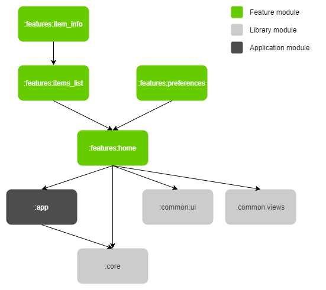

# Implementation details

## App architecture

Application is designed with multi-module approach powered by dynamic feature modules.
Gradle module dependency diagram:

Module purposes:

* **:app** - application module, glues the project together
* **:core** - basic infrastructure: DI, repository, etc.
* **:common**
    * **:ui** - common interface elements: recycler view decorators and layout managers, base Activity and Fragment, etc.
    * **:views** - custom widgets
* **:features**
    * **:home** - main screen with tabs navigation
    * **:items_list** - a list of to-do items
    * **:items_info** - a screen for viewing/editing a to-do item
    * **:preferences** - application preferences screen